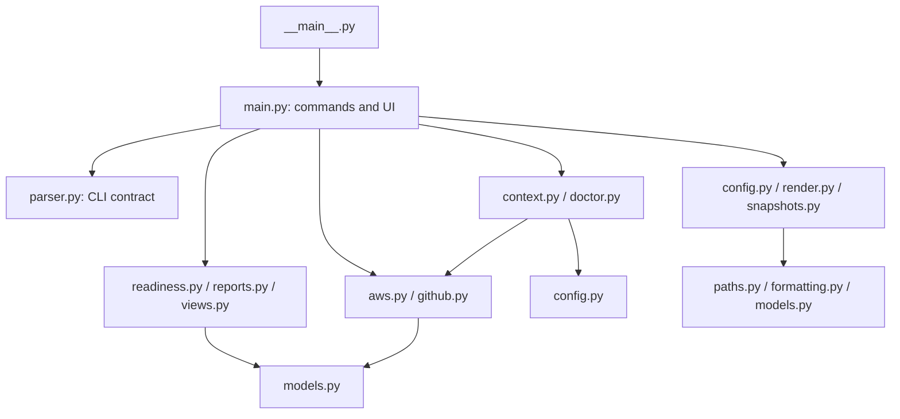

# CLI Architecture

The CLI is organized as a small application layer over independent domain and
integration modules. `devsecops_cli.main` owns command orchestration and the
interactive terminal UI; reusable behavior lives outside it.

## Module responsibilities

| Module | Responsibility |
| --- | --- |
| `main.py` | Command handlers, exit-code mapping, terminal interaction, and dependency composition. |
| `parser.py` | Argument parser and stable command-line contract. Receives the handler registry instead of importing `main`. |
| `config.py` | Config schema, presets, migration, validation, serialization, and security controls. |
| `render.py` | Deterministic generation of Terraform and GitHub helper artifacts. |
| `snapshots.py` | Snapshot manifests, safe local restore, and rollback boundaries. |
| `aws.py`, `github.py` | Provider adapters and provider-specific response normalization. |
| `doctor.py`, `context.py` | Diagnostic and next-action workflows composed from injected adapters. |
| `readiness.py` | Pure scoring, grouping, gap detection, and JSON serialization. |
| `reports.py`, `views.py` | Human-readable reports and presentation rows. |
| `contracts.py`, `completion.py` | Stable command/artifact metadata and shell completion generation. |
| `images.py` | ECR image parsing and immutable-image policy checks. |
| `models.py`, `paths.py`, `formatting.py` | Dependency-light shared foundations. |

## Dependency rules

1. Only the package entry point, `__main__.py`, may import `main.py`.
2. Domain and provider modules never import command handlers or terminate the
   process. They return normalized data or raise typed exceptions.
3. External commands, HTTP calls, clocks, and identifier generators are passed
   into workflow functions where tests need to replace them.
4. `main.py` re-exports established helpers as a compatibility boundary, while
   their implementation remains in the owning module.
5. Generated output stays deterministic: rendering receives a config value and
   does not read provider state implicitly.

The architecture tests reject dependency cycles and reverse imports back into
`main.py`. Behavioral compatibility is covered by the CLI unit, golden-output,
snapshot-safety, provider-adapter, and end-to-end tests.

## Adding functionality

- Add business rules to the narrowest domain module.
- Add AWS or GitHub translation at the provider boundary.
- Compose multi-step checks in `doctor.py` or `context.py`.
- Keep argument parsing declarative in `parser.py` and leave user interaction,
  output selection, and exit codes in the command layer.
- Add a focused module test and, when the CLI contract changes, a command-level
  test as well.
